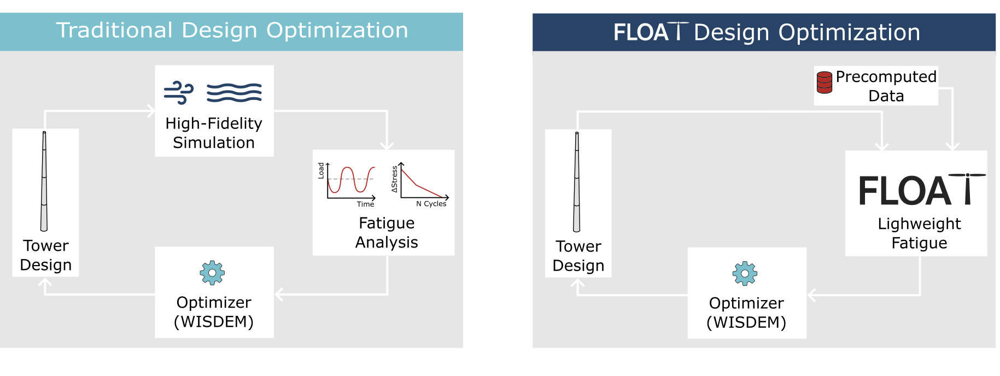
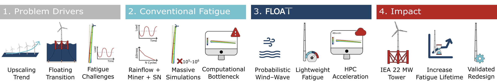
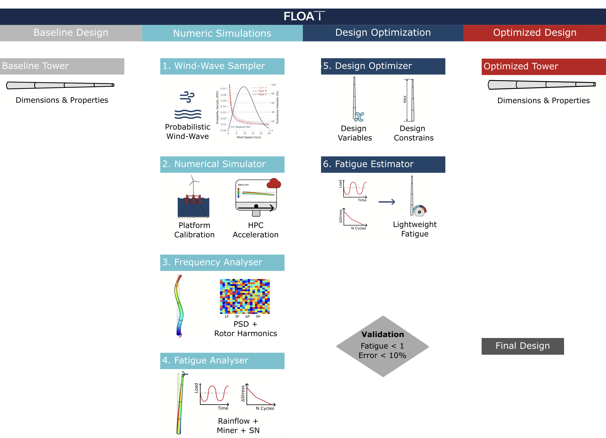

<p align="center">
  
</p>

# FLOAT: Fatigue-Aware Design Optimization of Floating Offshore Wind Turbine Towers
<p align="center">
  <a href="https://arxiv.org/abs/2601.01657">
    
  </a>
  <a href="https://joao97ribeiro.github.io/FLOAT/">
    
  </a>
  <a href="https://github.com/Joao97ribeiro/FLOAT-22-280-RWT-Semi">
    
  </a>
  <a href="https://www.apache.org/licenses/LICENSE-2.0">
    
  </a>
</p>

<p align="center"><strong>Fast tower fatigue estimation during design optimization, without rerunning high-fidelity simulations.</strong></p>


**FLOAT** is a **lightweight fatigue-aware tower design framework** integrated into [WISDEM](https://github.com/wisdem). It enables **fast estimation of cumulative tower fatigue damage** by scaling precomputed high-fidelity fatigue results from a reference wind turbine tower to any new tower geometry under evaluation.

This allows **fatigue-aware analysis and design optimization** to be performed **without rerunning expensive aero-hydro-servo-elastic simulations**, reducing computational cost by several orders of magnitude while maintaining validated accuracy with low error.

<p align="center">
  
</p>

### Authors: 
- **João Alves Ribeiro** (MIT & University of Porto) — [jpar@mit.edu](mailto:jpar@mit.edu)
- **Francisco Pimenta** (University of Porto)
- **Bruno Alves Ribeiro** (TU Delft & Brown University)
- **Sérgio M. O. Tavares** (University of Aveiro)
- **Faez Ahmed** (MIT) — [faez@mit.edu](mailto:faez@mit.edu)

---

<h3 align="center">⚠️ The FLOAT-redesigned tower is being adopted by the official <a href="https://iea-wind.org/task55/">IEA Wind Task 55 REFWIND</a> reference turbine.</h3>

<p align="center">
  Track its integration into the <strong>IEA 22-MW offshore reference wind turbine</strong> in
  <a href="https://github.com/IEAWindSystems/IEA-22-280-RWT/pull/164">IEAWindSystems/IEA-22-280-RWT PR #164</a>.
</p>

---


## FLOAT Paper 

**FLOAT** is presented in the following scientific paper, where the methodology implemented in this repository is fully described and validated: [**FLOAT: Fatigue-Aware Design Optimization of Wind Turbine Towers**](https://arxiv.org/abs/2601.01657).

<p align="center">
  
</p>

Using the **FLOAT** methodology, the [**IEA 22 MW**](https://github.com/IEAWindSystems/IEA-22-280-RWT) floating reference tower was successfully redesigned under fatigue constraints, achieving:
- **Fatigue lifetime extension:** from **~9 months to 25 years** (**~33× increase in fatigue life**)  
- **Validation accuracy:** agreement with **6,468 coupled wind–wave high-fidelity OpenFAST simulations** with a **mean relative error of −8.6%**  
- **Computational speed-up:** FLOAT removes the need to re-run full aero-hydro-servo-elastic simulations during redesign, cutting computational cost by **several orders of magnitude** compared with traditional fatigue-driven design loops.

The final redesigned tower configuration is openly available here: [**FLOAT-22-280-RWT-Semi**](https://github.com/Joao97ribeiro/FLOAT-22-280-RWT-Semi).

The paper introduces the full **FLOAT architecture**:

<p align="center">
  
</p>

**Note:** This repository currently includes **only Module 6, the Fatigue Estimator**, which corresponds to the lightweight fatigue scaling model.

The remaining components of the full FLOAT framework:

- **1. Wind–Wave Sampler:** Probabilistic wind–wave sampling.
- **2. Numerical Simulator:** High-fidelity OpenFAST calibration and HPC-based large-scale simulation workflows.
- **3. Frequency Analyzer:** Spectral stress processing.
- **4. Fatigue Analyzer:** Fatigue damage accumulation.

are planned to be released as open-source in future updates. The **5. Design Optimizer** is already implemented in **WISDEM**.


## What FLOAT Adds to WISDEM

**FLOAT lets you analyse and optimize a wind turbine tower with a per-section fatigue damage constraint, without ever re-running a high-fidelity simulation.** To do this, it extends WISDEM's native **_TowerSE_** module with a lightweight fatigue-aware model that scales a precomputed reference damage distribution to every candidate tower geometry the optimizer visits.

In practice, this means:
- A new `fatigue` block in the **TowerSE modeling options input file**, where you supply the reference tower and its precomputed `section_damage`.
- Native integration with the **WISDEM optimization workflow** so the fatigue damage shows up like any other TowerSE constraint.
- **Visualization and reporting utilities** for inspecting the results: overlay comparison plots of competing tower designs (geometry, fatigue damage, stress, buckling, deflection, mode shapes), convergence plots of the optimization run (objective and per-constraint evolution against their bounds), and JSON / log summary tables.

All remaining WISDEM modules remain unchanged and follow the official upstream implementation.


## How to Use FLOAT

To activate **FLOAT**, a `fatigue` block must be added to the **TowerSE modeling options input file**, following the structure below:

```yaml
WISDEM:
  TowerSE:
    flag: True

    fatigue:
      m: ...
      k: ...
      t_ref: ...

      tower_ref:
        grid: [...]
        outer_diameter: [...]
        wall_thickness: [...]
        z: [...]
        section_damage: [...]
```

where, for a tower with $N$ sections:

- The **material fatigue properties**:
  - `m` (float): S–N curve slope  
  - `k` (float): thickness exponent  
  - `t_ref` (float): reference design lifetime [years]  

- The **reference tower geometry**:
  - `grid` (array, size $N+1$): normalized vertical coordinate at each **section transition** along the tower (0 = base, 1 = top)
  - `outer_diameter` (array, size $N+1$): outer diameter at each **section transition** of the reference tower [m]
  - `wall_thickness` (array, size $N$): wall thickness at each **tower section** [m]
  - `z` (array, size $N+1$): physical height coordinate at each **section transition** [m]

- The **high-fidelity reference fatigue damage distribution** — this is the entry point for the precomputed damage values coming from the high-fidelity OpenFAST simulations (Modules 1–4 of the full FLOAT framework). FLOAT scales this reference distribution to every new candidate tower geometry without re-running OpenFAST:
  - `section_damage` (array, size $N$): cumulative fatigue damage per **tower section**, evaluated at the **section midpoint**


## Integration with the WISDEM Workflow

FLOAT integrates directly into the standard WISDEM workflow, which is based on three standard input files:

- **Modeling options file** (e.g. `modeling_options.yaml`)  
  This is where FLOAT is activated through the `fatigue` block inside the `TowerSE` section.

- **Turbine input file** (e.g. `IEA-22-280-RWT.yaml`)  
  Standard WISDEM turbine definition including geometry, materials, and main properties.

- **Analysis options file** (e.g. `analysis_options.yaml`)  
  Standard WISDEM simulation setup, load cases, and optional optimization configuration.

After defining these three files, WISDEM is executed normally.  
During the **TowerSE** execution, FLOAT automatically computes the fatigue damage for the new tower design **without re-running high-fidelity simulations**.


## Examples

The repository includes **eight example cases** demonstrating how to run **fatigue-aware tower analysis with FLOAT inside WISDEM**, from a single notebook-style call up to a full multi-step optimization workflow.

All examples use the [**IEA-22-280-RWT**](https://github.com/IEAWindSystems/IEA-22-280-RWT) reference turbine.

<p align="center">
  
</p>

- [`examples/01_tower_fatigue_analysis/`](./examples/01_tower_fatigue_analysis)  
  **Fatigue-Aware Tower Analysis (IEA 22 MW)** — Performs fatigue post-processing of the reference tower using the FLOAT lightweight scaling model.

- [`examples/02_tower_fatigue_optimization/`](./examples/02_tower_fatigue_optimization)  
  **Fatigue-Aware Tower Optimization (IEA 22 MW)** — Demonstrates the integration of FLOAT inside a tower design optimization loop, where fatigue damage directly influences the optimized tower geometry.

The CLI-style examples below wrap the same workflow into reusable tasks with `--flagfile` configs, and are chained together by example 08 to reproduce the FLOAT paper results end-to-end:

- [`examples/03_tower_fatigue_analysis_cli/`](./examples/03_tower_fatigue_analysis_cli) — CLI version of example 01: fatigue-aware tower analysis (reference case).
- [`examples/04_tower_fatigue_optimization_cli/`](./examples/04_tower_fatigue_optimization_cli) — CLI version of example 02: fatigue-aware tower optimization with profile plots.
- [`examples/05_tower_fatigue_optimized_comparison/`](./examples/05_tower_fatigue_optimized_comparison) — Overlay comparison of final tower designs (CSVs) against a chosen reference. Useful for visually inspecting how candidate towers differ in geometry, fatigue damage, stress, buckling, deflection, and mode shapes.
- [`examples/06_tower_fatigue_optimization_comparison/`](./examples/06_tower_fatigue_optimization_comparison) — Convergence comparison of multiple optimization runs (SQL + CSV). Useful for inspecting how the objective and each constraint evolved during the optimizer's iterations across different runs.
- [`examples/07_tower_fatigue_optimized_to_openfast/`](./examples/07_tower_fatigue_optimized_to_openfast) — Regenerates AeroDyn/ElastoDyn `.dat` files from an optimized WISDEM YAML. Useful after FLOAT produces an optimized tower and you want to plug it straight into OpenFAST for a high-fidelity simulation, without re-typing or copying values by hand.

- [`examples/08_float_paper_workflow/`](./examples/08_float_paper_workflow)  
  **FLOAT paper reproduction workflow** — Chains examples 03→07 to produce the reference case, two optimization runs (`opt1`, `opt2`), the comparison plots, and the OpenFAST `.dat` files for the final design. Run it with `python examples/08_float_paper_workflow/run.py`.

  > **Note:** All `section_damage` arrays consumed by FLOAT in this workflow are pre-computed from real high-fidelity OpenFAST simulations described in the FLOAT paper — one per reference tower (`ref`, `opt1`, `opt2`), each living in the `fatigue` block of the matching modeling YAML at [`examples/input_files/float_paper/`](./examples/input_files/float_paper). FLOAT scales these reference distributions across all candidate tower designs visited during optimization, so no OpenFAST run is triggered at design time.

The repository also ships the full set of WISDEM input files required to drive the fatigue-aware optimization out of the box, so no extra setup is needed:

- [`examples/input_files/float_paper/`](./examples/input_files/float_paper) — paper reproduction (reference + opt1 + opt2). Contains the geometry file (`IEA-22-280-RWT.yaml`), the modeling options with the `fatigue` block populated from the high-fidelity campaign, and the analysis options with the constraints and design variables used in the paper.
- [`examples/input_files/22mw_fatigue_example/`](./examples/input_files/22mw_fatigue_example) — minimal IEA 22 MW set-up for the standalone examples (`analysis_options.yaml`, `analysis_options_optimization.yaml`, `modeling_options_tower_fatigue.yaml`, `IEA-22-280-RWT.yaml`, `IEA-22-280-RWT_Floater.yaml`).
- [`examples/input_files/22mw_openfast/`](./examples/input_files/22mw_openfast) — OpenFAST AeroDyn/ElastoDyn templates used by example 07 to write the post-optimization `.dat` files.


## Installation

**FLOAT** runs inside a dedicated Conda environment for full compatibility with [WISDEM](https://github.com/WISDEM/WISDEM).

We recommend using [Miniforge3](https://github.com/conda-forge/miniforge) as a lightweight and more reliable alternative to [Anaconda](https://www.anaconda.com) for faster and more robust dependency resolution.


### 1. Create the Conda Environment
```bash
git clone https://github.com/Joao97ribeiro/FLOAT.git
cd FLOAT
conda env create -n float-env -f environment.yml
conda activate float-env
```
The environment name `"float-env"` is only a suggestion. You may choose any name.

> **Note (compilers):** FLOAT is a fork of WISDEM and builds its Fortran/C extensions from source via `meson + gcc/gfortran` during the next step. The provided `environment.yml` installs the conda-forge `compilers` metapackage so the toolchain is in place on Linux/macOS. If you create the environment by other means (custom env, system Python, Windows), make sure a working `gcc`/`g++`/`gfortran` is on `PATH` before running the `pip install` below — on Debian/Ubuntu this is `sudo apt install build-essential gfortran`, on macOS `xcode-select --install` plus `brew install gcc`, on Windows `m2w64-toolchain` from conda-forge.

### 2.  Install FLOAT in Developer Mode
```bash
pip install --no-deps -e . -v
```


## Running an Example

Each numbered folder under `examples/` is self-contained. Examples 01–02 are plain Python scripts you can run end-to-end or step through interactively in an IDE / REPL (e.g. Spyder, PyCharm or VS Code Python Interactive); examples 03–07 are CLI tasks invoked with `--flagfile` pointing at the example's bundled `config.cfg`; example 08 chains 03–07 together. From the repo root:

```bash
# Script-style example: run end-to-end or open in an IDE / REPL
python examples/01_tower_fatigue_analysis/tower_fatigue_analysis.py

# CLI-style example: just pass the flagfile shipped with the example
python examples/04_tower_fatigue_optimization_cli/task.py \
    --flagfile=examples/04_tower_fatigue_optimization_cli/config.cfg

# Full FLOAT paper workflow (chains 03 -> 07)
python examples/08_float_paper_workflow/run.py
```

Outputs land under `outputs/<example_name>/` (or under `outputs/08_float_paper_workflow/` for the chained workflow).


## Running the Tests

FLOAT carries the WISDEM test suite under [`wisdem/test/`](./wisdem/test). After
the environment is set up and the package is installed in developer mode, run
the full suite from the repo root with:

```bash
python test/test_all.py
```


## Documentation

The theoretical background and validation of the method are fully presented in the [**FLOAT paper**](https://arxiv.org/abs/2601.01657).  
Practical usage is demonstrated through the [`examples/`](./examples) scripts and inline docstrings provided in this repository.


## License

This project is licensed under the **Apache License 2.0**.  
See the [LICENSE](./LICENSE) file for full details or view it online at: [Apache License 2.0](https://www.apache.org/licenses/LICENSE-2.0).


## Citations

If you use **FLOAT** in your work, please cite:

> *FLOAT: Fatigue-Aware Design Optimization of Floating Offshore Wind Turbine Towers.*  
> João Alves Ribeiro, Francisco Pimenta, Bruno Alves Ribeiro, Sérgio M. O. Tavares, Faez Ahmed.  
> arXiv:2601.01657, 2026.  
> https://arxiv.org/abs/2601.01657

<details>
<summary>BibTeX</summary>

```bibtex
@misc{ribeiro2026floatfatigueawaredesignoptimization,
      title={FLOAT: Fatigue-Aware Design Optimization of Floating Offshore Wind Turbine Towers}, 
      author={João Alves Ribeiro and Francisco Pimenta and Bruno Alves Ribeiro and Sérgio M. O. Tavares and Faez Ahmed},
      year={2026},
      eprint={2601.01657},
      archivePrefix={arXiv},
      primaryClass={cs.CE},
      url={https://arxiv.org/abs/2601.01657}, 
}
```
</details>


## Maintenance & Support

For issues, questions, or feature requests related to FLOAT: [FLOAT Issues](https://github.com/Joao97ribeiro/FLOAT/issues).

## Acknowledgements
We thank [Garrett Barter](https://github.com/gbarter), [Pietro Bortolotti](https://github.com/ptrbortolotti), and [Daniel Zalkind](https://github.com/dzalkind) from the National Renewable Energy Laboratory (NREL) for their insightful discussions and technical guidance.

This work builds on a fork of [WISDEM](https://github.com/WISDEM/WISDEM). We acknowledge the WISDEM team for creating the open foundation that made this work possible.
